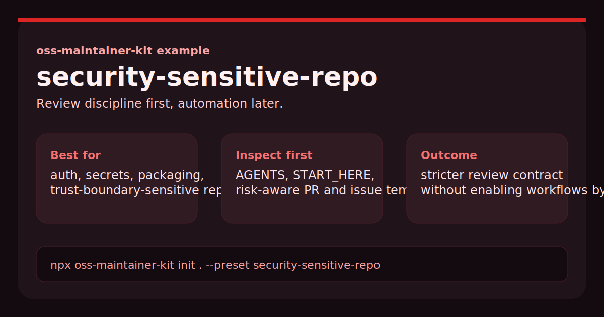

# OSS Maintainer Kit Security-Sensitive Example



This repository shows what the `security-sensitive-repo` preset from [oss-maintainer-kit](https://github.com/BlakeHampson/oss-maintainer-kit) looks like after scaffolding.

It was generated with:

```bash
npx oss-maintainer-kit init . \
  --repo-name oss-maintainer-kit-security-sensitive-example \
  --maintainer "Blake Hampson" \
  --preset security-sensitive-repo
```

## Why this repo exists

It is a concrete example for repositories where auth, secrets, packaging, trust boundaries, or incident risk require stricter maintainer guidance than the default starter provides.

## Quick scan

- `AGENTS.md`: higher-scrutiny review priorities
- `docs/START_HERE.md`: how to orient maintainers and AI reviewers in a sensitive repo
- `docs/MAINTAINER_WORKFLOW.md`: how to triage risk, validation, and docs sync
- `.github/PULL_REQUEST_TEMPLATE.md`: risk-aware PR framing
- `.github/ISSUE_TEMPLATE/*`: issue intake that distinguishes docs drift from sensitive behavior

## What this preset is trying to optimize

- tighter review discipline around sensitive code paths
- explicit validation and docs-sync expectations
- a safer starting point that does not enable optional Codex Actions by default

## Related project

- Main tool: <https://github.com/BlakeHampson/oss-maintainer-kit>
- npm package: <https://www.npmjs.com/package/oss-maintainer-kit>
- case study: <https://github.com/BlakeHampson/oss-maintainer-kit/blob/main/docs/CASE_STUDY_SHULEDOCS.md>
